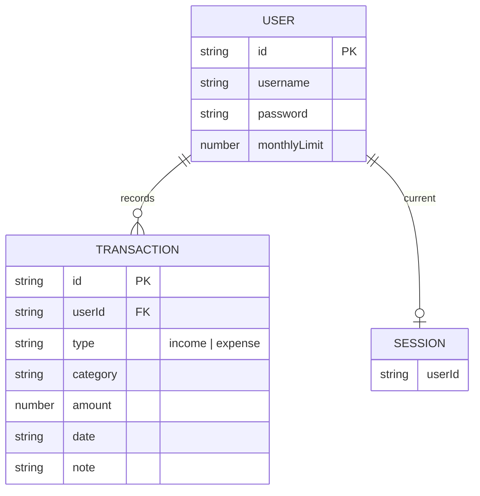

# ERD - Local Storage Schema

```mermaid
erDiagram
    USER {
        string id PK
        string username
        string password
        number monthlyLimit
    }
    TRANSACTION {
        string id PK
        string userId FK
        string type "income | expense"
        string category
        number amount
        string date
        string note
    }
    SESSION {
        string userId
    }

    USER ||--o{ TRANSACTION : "records"
    USER ||--o| SESSION : "current"
```

## Storage Keys

- `fintjam_users`: `Array<USER>`
- `fintjam_transactions`: `Array<TRANSACTION>`
- `fintjam_session`: `string` (userId)
